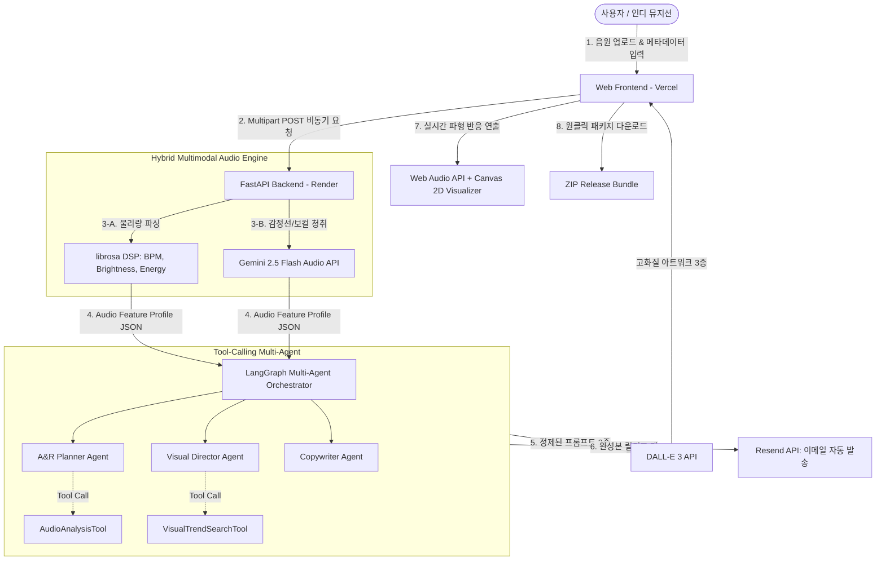

# Indie Album Studio (인디 앨범 스튜디오)

> **Audio Multimodal & Multi-Agent 기반 인디 뮤지션 올인원 AI 앨범 브랜딩 및 비주얼 에셋 서비스**  
> *"음원 파일 하나로 완성하는 A&R 기획서, 앨범 아트워크 3종, 주파수 반응형 비주얼라이저, 그리고 발매 홍보 패키지"*

---

## 1. 프로젝트 소개 (Overview)

1인 창작자 및 소규모 인디 뮤지션은 고품질의 음악을 완성하고도 외주 비용(앨범 커버 50만 원, 비주얼라이저 100만 원)과 디렉팅 역량 부족으로 발매 단계에서 심각한 병목을 겪습니다.

**"인디 앨범 스튜디오"**는 음원 파일(`.mp3`, `.wav`)을 업로드하면, **[오디오 DSP 물리량 + Gemini 2.5 Flash 청각 분석]**의 2-Track 하이브리드 멀티모달 파이프라인으로 사운드 특성을 추출하고, **LangGraph 기반 Multi-Agent 시스템**이 협업하여 3분 안에 **[A&R 콘셉트 기획서 + 고화질 앨범 아트워크 3종 + 주파수 반응형 비주얼라이저 + 발매 홍보 카피 + 이메일 릴리즈 팩 자동 전송]**을 일괄 완성하는 웹 플랫폼입니다.

---

## 2. 팀원 및 역할 분담 (Team R&R)

모든 팀원이 프로젝트에 실질적으로 기여하며 역량에 맞는 전문성을 발휘할 수 있도록 체계적으로 분업화되었습니다.

| 이름 | 포지션 | 세부 담당 업무 | 주요 산출물 |
| :---: | :--- | :--- | :--- |
| **팀장 (본인)** | Product Lead & Lead UI/UX | • 다크 테마 UI/UX 디자인 시스템 구축<br>• 프론트엔드 코어 마크업 및 비주얼 프롬프트 정밀 튜닝<br>• 스프린트 리딩 및 GitHub 형상 관리 총괄 | Figma 원본, 프론트 레이아웃 커밋, 비주얼 프롬프트 로그 |
| **팀원 1** | Tech Lead & AI / Backend | • FastAPI 비동기 백엔드 아키텍처 및 Render 배포<br>• librosa DSP + Gemini 2.5 Flash 하이브리드 오디오 엔진<br>• LangGraph ReAct Tool-calling 멀티에이전트 구현 | 백엔드 코어 API, 멀티모달 파이프라인 커밋, 아키텍처 다이어그램 |
| **팀원 2** | Frontend (Audio & Motion) | • Web Audio API & Canvas 2D 주파수 반응형 비주얼라이저<br>• 비동기 상태 Polling 진행률 UI 연동<br>• 브라우저 시스템 알림 및 클립보드 복사 인터랙션 | 비주얼라이저 캔버스 코드, API 통신 인터랙션 커밋 |
| **팀원 3** | AI Workflow & Auxiliary Backend | • DALL-E 3 API 연동 및 비용 절감용 Mock 모드 스위치<br>• Resend API 이메일 릴리즈 팩 자동 발송 파이프라인<br>• 홍보 카피라이팅 프롬프트 및 JSON 스키마 검증 | 이미지 연동 모듈, 이메일 자동화 파이프라인 커밋 |
| **팀원 4** | Product Operations & QA | • **실사용자 5인(인디 뮤지션) 테스트 총괄 및 개선 보고서**<br>• 장르별 음원 샘플 20종 메타데이터 데이터셋 구축<br>• QA 테스트케이스 작성, 이슈 트래킹, 최종 발표 자료 제작 | 실사용자 피드백 보고서(필수 요건), 테스트 데이터셋 JSON, 발표 PPT |

---

## 3. 기술 스택 (Tech Stack)

* **AI & Multimodal:** Google Gemini 2.5 Flash (Audio Input), OpenAI DALL-E 3, GPT-4o-mini
* **Agent Framework:** LangGraph, LangChain (ReAct Tool-calling 패턴)
* **Audio DSP Engine:** Python `librosa`, `soundfile`, `scipy`, `numpy`
* **Frontend:** HTML5, CSS3, Vanilla JavaScript, Web Audio API, Canvas 2D, Web Notification API
* **Backend:** Python 3.10+, FastAPI, Uvicorn, Pydantic
* **DevOps & Cloud:** Vercel (Frontend), Render (Backend), GitHub Actions, Resend API (Email)

---

## 4. 시스템 아키텍처 (System Architecture)



---

## 5. 실행 방법 (Getting Started)

### 로컬 프론트엔드 실행
별도의 빌드 도구 없이 브라우저에서 바로 열 수 있습니다.
```bash
cd frontend
# VS Code 'Live Server' 확장 프로그램을 사용하거나
# Python 간이 서버 실행:
python -m http.server 3000
```
브라우저에서 `http://localhost:3000` 접속

### 로컬 백엔드 실행
```bash
cd backend
python -m venv venv
# Windows:
venv\Scripts\activate
# Mac/Linux:
source venv/bin/activate

pip install -r requirements.txt
uvicorn main:app --reload --port 8000
```
API 문서 확인: `http://localhost:8000/docs`

---

## 6. 라이선스 및 AI 윤리 규정
* 본 서비스로 생성된 모든 에셋에는 'AI Generated' 메타데이터가 명시됩니다.
* 사용자는 본인의 자작곡 또는 합법적 권리를 보유한 음원만을 업로드해야 합니다.
